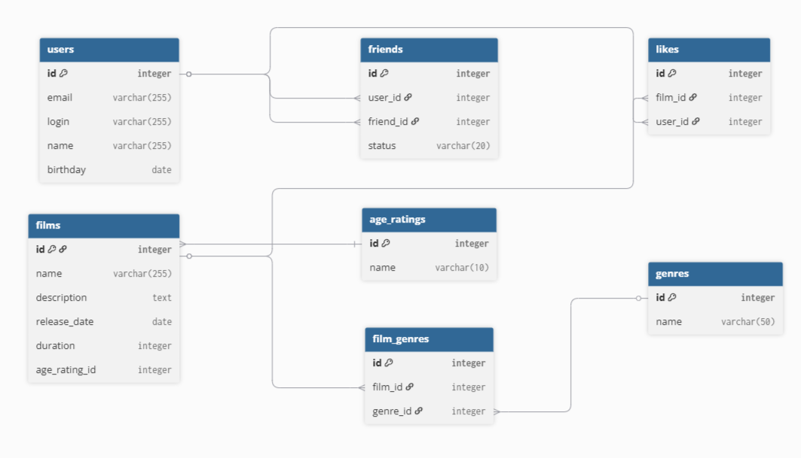

# Приложение Filmorate

# Описание ER-диаграммы
1. Таблица users содержит в себе всех пользователей приложения Filmorate.
2. Таблица friends содержит в себе id пользователей, которые решили дружить между двумя пользователями.
3. Таблица likes содержит id фильмя и пользователя, который его(фильм) оценил.
4. Таблица film содержит в себе все фильмы приложения Filmorate.
5. Таблица age_ratings содержит возрастной рейтинг фильмов.
6. Таблица film_genres, обеспещивает звязь "многие ко многим" между таблицей films и genres.[^1]
7.Таблица genres содержит в себе жанры фильмов.
   
[^1]:Один фильм может содержать множество жанров, один жанар может принадлежать множуству фильмов.

